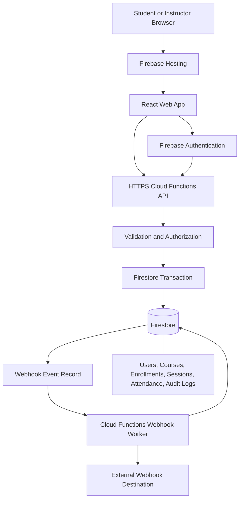

# AttendanceFlow Platform Architecture

## Trust Boundaries

1. The browser is untrusted and cannot determine role, time eligibility, or ownership.
2. Cloud Functions verify identity and enforce business rules before mutations.
3. Firestore rules deny direct writes to server-managed attendance, audit, and webhook collections.
4. The webhook worker sends only the minimum required payload and records delivery status.
